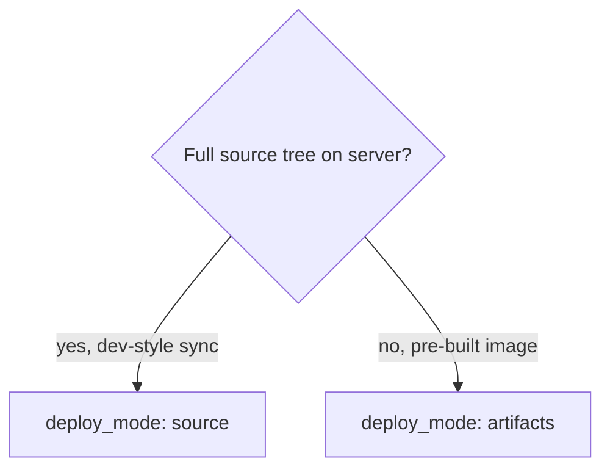

# docker-ops (`dq`) — operator guide for humans and AI

This document complements [readme.md](../readme.md). Use it to choose deploy settings and to ask the user the right questions before changing `docker-ops.yaml` / `dq.env`.

## AI: rules

- **MUST NOT** add `deploy_engine: api` unless the user wants finish without `docker compose` on the server.
- **MUST** keep backward compatibility: missing new keys = old behavior (`deploy_engine` → `compose`).
- **MUST** update readme + this file when adding config keys.
- **ASK USER IF** deploy mode, registry vs save/load, or live DB data on server is unclear.

## Purpose

`dq` (Docker Quick-ops):

- Deploys from the **developer machine** to a **remote host over SSH**.
- Does **not** install the `dq` binary on the server.
- Uses **Compose V2** (`docker compose`) by default on the remote host.

`dq` does **not** replace full CI/CD or sign images (cosign etc.) in v1.

## Config precedence (§14.1)

Strongest wins:

1. Process environment (`export`, CI)
2. `dq.env`
3. `docker-ops.yaml` / `docker-ops.yml`

| YAML key | Environment variable |
|----------|---------------------|
| `deploy_mode` | `DEPLOY_MODE` |
| `deploy_image` | `DEPLOY_IMAGE` |
| `deploy_images` | `DEPLOY_IMAGES` (comma `svc=ref,…`) |
| `deploy_engine` | `DEPLOY_ENGINE` |
| `remote_docker_socket` | `REMOTE_DOCKER_SOCKET` |
| `remote_docker_socket_service` | `REMOTE_DOCKER_SOCKET_SERVICE` |
| `deploy_skip_unchanged` | `DEPLOY_SKIP_UNCHANGED` |
| `deploy_layer_sync` | `DEPLOY_LAYER_SYNC` |
| `remote_ssh` | `REMOTE_SSH` |
| `remote_path` | `REMOTE_PATH` |

## Decision: `deploy_mode`



- **`source`**: SFTP mirror of project → remote `docker compose build --pull && up -d`. Risky if server has extra data not in local tree (mirror may delete extras).
- **`artifacts`**: Build/push or save/load image(s), upload `docker-compose.image.yml` + optional `app_config` / `deploy_include`.

## Decision: image delivery

| Condition | Path |
|-----------|------|
| Image ref contains `/` (e.g. `ghcr.io/...`) or `deploy_use_registry: true` | Registry push/pull |
| Local tag without `/`, or `deploy_save_load: true` | `docker save \| ssh \| docker load` |
| `deploy_build_remote: true` | SFTP full tree → build on server |

## Decision: `deploy_engine`

| Value | Behavior |
|-------|----------|
| **`compose`** (default) | Remote `docker compose pull\|up` — same as before |
| **`auto`** | Try Docker API apply via SSH `docker.sock` tunnel; fallback to compose |
| **`api`** | API apply only (no compose on finish); requires tunnel |

API apply is **artifacts only**. `source` mode always uses compose.

## Decision: `remote_docker_socket`

Used when opening API tunnel (`deploy_engine: auto|api`, or optional transfer optimization).

| Setting | When |
|---------|------|
| `auto` (default) | Detect via remote `DOCKER_HOST`, `docker context`, systemd unit, then probe paths |
| Explicit path | Rootless, multiple sockets, non-standard install |
| `remote_docker_socket_service: docker.socket` | Force systemd unit inspect |

## Must-ask checklist

**Connection**

- `remote_ssh`, `remote_path`?
- SSH key / agent?
- Is **Compose V2** on server? (required for default `compose` engine)

**Deploy**

- `source` or `artifacts`?
- Live database/files on server outside git?

**Images**

- One `deploy_image` or `deploy_images` / `DEPLOY_IMAGES`?
- Build locally or `deploy_build_remote`?
- Registry (ref with `/`) or save/load?

**API path (only if requested)**

- Can server work without compose plugin on finish?
- Rootless Docker? Multiple sockets?
- OpenSSH streamlocal support?

**Expectations**

- Skip redeploy when image unchanged? (`deploy_skip_unchanged`, default true)
- Bandwidth limits → save/load + `deploy_layer_sync`

## Minimal configs

### Legacy artifacts + compose (default)

```yaml
remote_ssh: user@host
remote_path: /opt/app
deploy_mode: artifacts
compose_file: docker-compose.image.yml
deploy_image: myapp:1.0.0
deploy_push: true
```

### Registry

```yaml
deploy_mode: artifacts
deploy_image: ghcr.io/org/app:1.0.0
deploy_push: true
```

### API opt-in

```yaml
deploy_mode: artifacts
deploy_engine: auto
remote_docker_socket: auto
deploy_image: myapp:1.0.0
deploy_push: true
```

## Footguns

- **`source` + data on server** — mirror can remove server-only dirs.
- **`go install` vs Releases** — `dq version` may show Go pseudo-version; use Release binary for marketing tag.
- **Compose V2** — standalone `docker-compose` V1 is not supported.

## Verification

```bash
dq validate
dq version
# after deploy:
dq ps
```

## Backward compatibility

- No new keys → **`deploy_engine=compose`**, no API tunnel required.
- Hash/layer optimization uses API only when tunnel opens; otherwise CLI save/push unchanged.
- New keys are additive only.

See also [AGENTS.md](../AGENTS.md).
